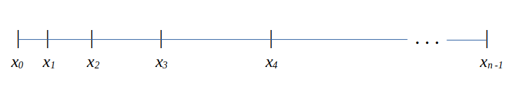

Field Solvers
=============

Finite difference Poisson equation
----------------------------------

Solvers on uniform grid
~~~~~~~~~~~~~~~~~~~~~~~

Solvers on non-uniform grid
~~~~~~~~~~~~~~~~~~~~~~~~~~~
This section was prepared by

-  Huq Md Fazlul, UIUC

1D Non-uniform Grid
~~~~~~~~~~~~~~~~~~~

FD Stencil for 1D First Derivative
^^^^^^^^^^^^^^^^^^^^^^^^^^^^^^^^^^

Let’s consider the problem,

.. math:: 
   :label: eq_1stdev1

   E_i = - \frac{d\phi}{dx}|_i 

Let’s consider the boundary conditions and grading ratio are,

.. math::

   \begin{aligned}
   \phi{(x_0)} = left\  bc = 0;\\
   \phi{(x_{n-1})} = right\  bc = 0;\\
   \Delta{x_i} = x_{i+1} - x_i = r\Delta{x_{i-1}};\\
   r = Grading\ ratio =\frac{\Delta{x_i}}{\Delta{x_{i-1}}};
   \end{aligned}

Now, using Taylor series expansion at :math:`\phi_{i+1}` we get,

.. math::
   :label: eq_1stdev2
   
   \phi_{i+1} = \phi_i+(\Delta x_i) \frac{\partial \phi}{\partial x}|_{i}+\frac{\Delta x_i^2}{2!}\frac{\partial^2\phi}{\partial x^2}|_i +......

And, using Taylor series expansion at :math:`\phi_{i-1}` we get,

.. math::
   :label: eq_1stdev3

   \phi_{i-1} = \phi_i-(\Delta x_{i-1}) \frac{\partial \phi}{\partial x}|_{i}+\frac{\Delta x_{i-1}^2}{2!}\frac{\partial^2\phi}{\partial x^2}|_i -......

Subtracting equation :eq:`eq_1stdev3` from equation :eq:`eq_1stdev2` and ignoring higher order terms we get,

.. math::
   :label: eq_1stdev4

   \phi_{i+1}-\phi_{i-1} = (\Delta x_i + \Delta x_{i-1})\frac{\partial \phi}{\partial x}|_{i}

Rearranging we get,

.. math::
    :label: eq_1stdev5
    
    \frac {\partial \phi}{\partial x}|_i = \frac{\phi_{i+1}-\phi_{i-1}}{\Delta x_i + \Delta x_{i-1}} = \frac{r(\phi_{i+1}-\phi_{i-1})}{(r+1)\Delta x_i} = \frac{\phi_{i+1}-\phi_{i-1}}{(r+1)\Delta x_{i-1}}

Therefore, from equation :eq:`eq_1stdev1` we can write,

.. math::
    :label: eq_1stdev6
    
    E_i = - \frac {\partial \phi}{\partial x}|_i = - \frac{\phi_{i+1}-\phi_{i-1}}{\Delta x_i + \Delta x_{i-1}} = - \frac{r(\phi_{i+1}-\phi_{i-1})}{(r+1)\Delta x_i} = - \frac{\phi_{i+1}-\phi_{i-1}}{(r+1)\Delta x_{i-1}}

1D Non-uniform Mesh Stencil for Poisson Solver
^^^^^^^^^^^^^^^^^^^^^^^^^^^^^^^^^^^^^^^^^^^^^^
Let's consider the problem,

.. math::
   :label: eq_2nddev1

   \nabla^2 \phi(x) = - \frac{\rho}{\epsilon_0}

where, :math:`\rho` is the charge density and :math:`\epsilon_0` is the permittivity of free space.

Full Poisson problem: Dirichlet boundary conditions 
~~~~~~~~~~~~~~~~~~~~~~~~~~~~~~~~~~~~~~~~~~~~~~~~~~~

Let's consider the boundary conditions and grading ratio are,

.. math::
   :label: eq_2nddev2

   \begin{aligned}
   \phi{(x_0)} = left\  bc = 0;\\
   \phi{(x_{n-1})} = right\  bc = 0;\\
   \Delta{x_i} = x_{i+1} - x_i = r\Delta{x_{i-1}};\\
   r = Grading\ ratio =\frac{\Delta{x_i}}{\Delta{x_{i-1}}};
   \end{aligned}

Now, using Taylor series expansion at :math:`\phi_{i+1}` we get,

.. math::
   :label: eq_2nddev3

   \phi_{i+1} = \phi_i+(\Delta x_i) \frac{\partial \phi}{\partial x}|_{i}+\frac{\Delta x_i^2}{2!}\frac{\partial^2\phi}{\partial x^2}|_i + \frac{\Delta x_i^3}{3!}\frac{\partial^3\phi}{\partial x^3}|_i + ......

And, using Taylor series expansion at :math:`\phi_{i-1}` we get,

.. math::
   :label: eq_2nddev4

   \phi_{i-1} = \phi_i-(\Delta x_{i-1}) \frac{\partial \phi}{\partial x}|_{i}+\frac{\Delta x_{i-1}^2}{2!}\frac{\partial^2\phi}{\partial x^2}|_i - \frac{\Delta x_{i-1}^3}{3!}\frac{\partial^3\phi}{\partial x^3}|_i + ......

Multiplying equation :eq:`eq_2nddev4` by :math:`r` and adding with equation :eq:`eq_2nddev3` we get,

.. math::
   :label: eq_2nddev5

   \phi_{i+1}+r\phi_{i-1} = (1+r)\phi_i+(\Delta x_i - r\Delta x_{i-1})\frac{\partial \phi}{\partial x}|_{i} +\frac{(\Delta x_i)^2 + r(\Delta x_{i-1})^2}{2}\frac{\partial^2\phi}{\partial x^2}|_i 

Since :math:`\Delta{x_i} = r\Delta{x_{i-1}}`, second term of the right hand side is  eliminated and we get,

.. math::
   :label: eq_2nddev6

   \phi_{i+1}+r\phi_{i-1} = (1+r)\phi_i+\frac{(\Delta x_i)^2 + r(\Delta x_{i-1})^2}{2}\frac{\partial^2\phi}{\partial x^2}|_i

.. math::
   :label: eq_2nddev7

   => r\phi_{i-1}-(r+1)\phi_i+\phi_{i+1} = \frac{(\Delta x_i)^2 + r(\frac{\Delta x_{i}}{r})^2}{2}\frac{\partial^2\phi}{\partial x^2}|_i
   
.. math::
   :label: eq_2nddev8

   => r\phi_{i-1}-(r+1)\phi_i+\phi_{i+1} = \frac{(\Delta x_i)^2 + \frac{(\Delta x_{i})^2}{r}}{2}\frac{\partial^2\phi}{\partial x^2}|_i

.. math::
    :label: eq_2nddev9
    
    => \frac{\partial^2\phi}{\partial x^2}|_i = \frac{r\phi_{i-1}-(r+1)\phi_i+\phi_{i+1}}{(\frac{r+1}{2r})(\Delta x_i)^2} 

.. math::
    :label: eq_2nddev10
    
    => \frac{\partial^2\phi}{\partial x^2}|_i = \frac{(\frac{2r^2}{r+1})\phi_{i-1}-2r\phi_i+(\frac{2r}{r+1})\phi_{i+1}}{(\Delta x_i)^2}

So, the discrete finite difference form of equation :eq:`eq_2nddev1` is, 

.. math::
   :label: eq_2nddev11

   => \frac{\partial^2\phi}{\partial x^2}|_i = \frac{(\frac{2r^2}{r+1})\phi_{i-1}-2r\phi_i+(\frac{2r}{r+1})\phi_{i+1}}{(\Delta x_i)^2} = -(\frac{\rho}{\epsilon_0})_i 

Corresponding stencil is :math:`((\frac{2r^2}{r+1}), -2r, (\frac{2r}{r+1}))`.

So, the system of linear equations are,

.. math::

    \label{eq_2nddev12} 
    \phi_0 = 0;

.. math::

    \label{eq_2nddev13}
    (\frac{2r^2}{r+1})\phi_0-2r\phi_1+(\frac{2r}{r+1})\phi_2 = (\Delta x_1)^2 (-(\frac{\rho}{\epsilon_0})|_1);

.. math::

    \label{eq_2nddev14}
    (\frac{2r^2}{r+1})\phi_1-2r\phi_2+(\frac{2r}{r+1})\phi_3 = (\Delta x_2)^2 (-(\frac{\rho}{\epsilon_0})|_2);

.. math::

    \label{eq_2nddev15}
    (\frac{2r^2}{r+1})\phi_2-2r\phi_3+(\frac{2r}{r+1})\phi_4 = (\Delta x_3)^2 (-(\frac{\rho}{\epsilon_0})|_3);

.. math::

    \label{eq_2nddev16}
   .......................................\\
   .......................................

.. math::

    \label{eq_2nddev17}
    (\frac{2r^2}{r+1})\phi_{n-3}-2r\phi_{n-2}+(\frac{2r}{r+1})\phi_{n-1} = (\Delta x_{n-2})^2 (-(\frac{\rho}{\epsilon_0})|_{n-2});

.. math::

    \label{eq_2nddev18}
    \phi_{n-1} = 0;

Corresponding matrix-vector representation of system of linear equations will be,

.. math::
    :label: eq_2nddev19

    Ax = b

Where, the matrix :math:`A` is,

.. math::
    :label: eq_2nddev20

    A = \begin{vmatrix}
    1&0&0&0&..&..&..&0\\
    \frac{2r^2}{(r+1)}&-2r&\frac{2r}{r+1}&0&0&..&..&..\\
    0&\frac{2r^2}{(r+1)}&-2r&\frac{2r}{r+1}&0&..&..&..\\
    ..&..&..&..&..&..&..&..\\
    ..&..&..&..&..&..&..&..\\
    0&..&..&..&..&\frac{2r^2}{(r+1)}&-2r&\frac{2r}{r+1}\\
    0&0&..&..&..&..&0&1\\
    \end{vmatrix}

The vector :math:`\vec x` is,

.. math::
    :label: eq_2nddev21

    \vec x = \begin{vmatrix}
    \phi_0\\
    \phi_1\\
    \phi_2\\
    ..\\
    ..\\
    \phi_{n-2}\\
    \phi_{n-1}
    \end{vmatrix}

The vector :math:`\vec b` is,

.. math::
    :label: eq_2nddev22

    \vec b = \begin{vmatrix}
    0\\
    -((\Delta x_1)^2 (\frac{\rho}{\epsilon_0})_1)\\
    -((\Delta x_2)^2 (\frac{\rho}{\epsilon_0})_2)\\
    ..\\
    ..\\
    -((\Delta x_{n-2})^2 (\frac{\rho}{\epsilon_0})_{n-2})\\
    0
    \end{vmatrix} + \begin{vmatrix}
    left \ bc\\
    0\\
    0\\
    ..\\
    ..\\
    0\\
    right \ bc
    \end{vmatrix}

.. math::
    :label: eq_2nddev23

    => \vec b = \begin{vmatrix}
    left \ bc\\
    -((\Delta x_1)^2 (\frac{\rho}{\epsilon_0})_1)\\
    -((\Delta x_2)^2 (\frac{\rho}{\epsilon_0})_2)\\
    ..\\
    ..\\
    -((\Delta x_{n-2})^2 (\frac{\rho}{\epsilon_0})_{n-2})\\
    right \ bc
    \end{vmatrix}

Therefore the :math:`A \vec x = \vec b` system of equations will be, 

.. math::
    :label: eq_2nddev24

    \begin{vmatrix}
    1&0&0&0&..&..&..&0\\
    \frac{2r^2}{(r+1)}&-2r&\frac{2r}{r+1}&0&0&..&..&..\\
    0&\frac{2r^2}{(r+1)}&-2r&\frac{2r}{r+1}&0&..&..&..\\
    ..&..&..&..&..&..&..&..\\
    ..&..&..&..&..&..&..&..\\
    0&..&..&..&..&\frac{2r^2}{(r+1)}&-2r&\frac{2r}{r+1}\\
    0&0&..&..&..&..&0&1\\
    \end{vmatrix} 
    \begin{vmatrix}
    \phi_0\\
    \phi_1\\
    \phi_2\\
    ..\\
    ..\\
    \phi_{n-2}\\
    \phi_{n-1}
    \end{vmatrix} = \begin{vmatrix}
    left \ bc\\
    -((\Delta x_1)^2 (\frac{\rho}{\epsilon_0})_1)\\
    -((\Delta x_2)^2 (\frac{\rho}{\epsilon_0})_2)\\
    ..\\
    ..\\
    -((\Delta x_{n-2})^2 (\frac{\rho}{\epsilon_0})_{n-2})\\
    right \ bc
    \end{vmatrix}

This is for Dirichlet boundary condition on both ends. 

Finite element method Poisson equation
---------------------------------------
