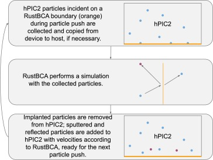

Interactions
=============

This page describes methods for modeling collisions and interactions between
species in hPIC2.

Monte Carlo collisions
-----------------------

Monte Carlo collision (MCC) methods form a family of algorithms that model
collisions between a particle-based "source" species and a
continuum "target" species.
The industry standard is the null collision method :cite:`vahedi1993capacitive`;
throughout this section, when we refer to MCC,
we refer specifically to this method.

MCC allows a source species to collide with arbitrarily many target species,
but an individual source particle may only undergo a maximum of one
collision per time step.
For each source particle, we could compute a collision probability from the sum
of collision rates over all :math:`N` possible collisions as

.. math::

    P = 1 - \exp \left( - \Delta t \sum_{i=1}^N n_i \sigma_i (\vec{g}_i) g_i \right),

where :math:`\Delta t` is the time step size,
:math:`n_i = n_i(\vec{x})` is the local number density of the target for collision :math:`i`,
:math:`\sigma_i = \sigma_i(\vec{g})` is the collision cross section function,
and :math:`\vec{g}_i` is the relative velocity between the source particle
and its target collision partner.
Collision partners are drawn randomly from the target species' distribution.

It can be expensive to compute the collision probability for each particle.
Instead, we add a fictitious "null" collision whose cross section is such that
the total collision frequency is constant.
We choose the constant collision frequency to be

.. math::

    \nu' = \max_{\vec{x}, \vec{g}} \sum_{i=1}^N n_i (\vec{x}) \sigma_i (\vec{g}) g.

Now the maximum fraction of particles that will undergo collisions is

.. math::
    P_{\text{null}} = 1 - \exp \left( - \Delta t \nu' \right) \approx \Delta t \nu'.

Given :math:`M` particles, :math:`\lceil M P_{\text{null}} \rceil`
are randomly sampled without replacement.
We must then decide which type of collision will occur for each such particle.
Uniformly draw a random number :math:`U \in [0,1)`.
Then collision :math:`i` will occur if

.. math::

    \frac{\sum_{j=1}^{i-1} n_j \sigma_j (\vec{g}_j) g_j}{\nu'} \leq
    U <
    \frac{\sum_{j=1}^{i} n_j \sigma_j (\vec{g}_j) g_j}{\nu'},

and the null collision will occur if

.. math::

    \frac{\sum_{i=1}^N n_i \sigma_i (\vec{g}_i) g_i}{\nu'} \leq U

for the selected particle,
again where collision partners are drawn randomly
from the target species' distribution.
This strategy weights the possible collisions by their collision rates.

Many things can happen when a collision occurs.
If the collision is meant to model ionizing source electrons impinging on
a neutral target,
the collision may spawn a new electron and a new ion;
if the collision models elastic scattering events,
the source particle's trajectory may simply be skewed to reflect the collision.

RustBCA coupling
------------------

The binary-collision approximation (BCA) method
is a way of modeling plasma-material interactions.
BCA considers the collision cascade undergone by ions incident on a material
surface as a sequence of elastic, binary collisions,
together with inelastic electronic stopping.
This is a good approximation for modeling
implantation, sputtering, and reflection with incident ion energies
on the order of \~ :math:`1 - 10^8` eV.

`RustBCA <https://github.com/lcpp-org/RustBCA>`_ :cite:`drobny2021rustbca`
is a BCA code that enables in-memory coupling to other codes, such as hPIC2.
The workflow for the PIC-BCA coupling used by hPIC2 is illustrated in the
figure below.

Use of RustBCA in hPIC2 is described
:ref:`here <input_deck:RustBCA boundary condition>`.

Coulomb collision force
----------------------------

Coulomb collisions are long-range collisions that act under the Coulomb
potential between charged particles. In certain plasma regimes, Coulomb
collisions contribute significantly to plasma thermalization, especially
in strongly collisional plasmas where fluid approximations are
appropriate.
One way of approximating the effect of Coulomb collisions is by imposing
a macroscopic force on affected PIC particles
that is informed by the state of the other species.

Recall that the Boltzmann equation for a single charged species
:math:`s` under only electromagnetic external forces is given by

.. math:: \frac{\partial f_s}{\partial t} + \vec{v} \cdot \frac{\partial f_s}{\partial \vec{x}} + \frac{q_s}{m_s} \left( \vec{E} + \vec{v} \times \vec{B} \right) \cdot \frac{\partial f_s}{\partial \vec{v}} = \mathcal{C}[f_s],

where :math:`f_s` is the single-particle distribution function,
:math:`q_s` and :math:`m_s` are the charge and mass of the species,
respectively, :math:`\vec{E}` and :math:`\vec{B}` are the
self-consistent electric and magnetic fields, respectively, and
:math:`\mathcal{C}` is a functional that encodes changes in the
distribution due to collisions, hereafter referred to as the collision
operator. Generally the collision operator takes the form

.. math:: \mathcal{C}[f_s] = \sum C_{\alpha} [f_s, f_t],

where :math:`C_\alpha [f_s, f_t]` is the collision operator for a single
collision type :math:`\alpha` occuring between an ion species :math:`s` and
another, perhaps electron, species :math:`t`.
Hence the full collision operator is properly the sum over
individual collision operators for all possible collisions.

A discussion of the role of the Coulomb logarithm is beyond the scope of
this document, but a sensible definition is :cite:`fitzpatrick2014plasma`

.. math::

   \ln \Lambda =
       \begin{cases}
           30 - \ln \left( \sqrt{\frac{n_t Z_s^3}{(kT_s)^3}} A_s \right) & kT_t < kT_s m_t / m_s, \\
           23 - \ln \left( \sqrt{\frac{n_t}{(kT_t)^3}} Z_s \right) & kT_s m_t / m_s < kT_t < 10 Z_s^2 \text{ eV}, \\
           24 - \ln \left( \sqrt{n_t} (kT_t)^{-1} \right) & kT_t > 10 Z_s^2 \text{ eV},
       \end{cases}

where :math:`n_s` is the number density of species :math:`s`,
:math:`T_s` is the temperature of species :math:`s`,
:math:`Z_s \equiv q_s / e` is the charge number, and :math:`A_s`
is the ion mass number.

Define the functions

.. math::

   \begin{aligned}
       F_1(\zeta) &= \mathop{\mathrm{erf}}(\zeta) - \zeta \frac{d \mathop{\mathrm{erf}}}{d \zeta}, \\
       F_2(\zeta) &= \left( 1 - 2 \zeta^2 \right) \mathop{\mathrm{erf}}(\zeta) - \zeta \frac{d \mathop{\mathrm{erf}}}{d \zeta}, \\
       F_3(\zeta) &= \left( 1 - \frac{2}{3} \zeta^2 \right) \mathop{\mathrm{erf}}(\zeta) - \zeta \frac{d \mathop{\mathrm{erf}}}{d \zeta},
   \end{aligned}

where :math:`\mathop{\mathrm{erf}}` is the error function. Also define
the constant

.. math:: \gamma_{st} = \left( \frac{q_s q_t}{4 \pi \epsilon_0} \right)^2 2 \pi \ln \Lambda.

Assuming that :math:`m_t/m_s \ll 1`, and that species :math:`t`
follows a Maxwellian disribution, an approximation for
:math:`C_{st}` is

.. math:: C_{st} = - \frac{1}{m_s} \frac{\partial}{\partial \vec{v}} \cdot \vec{A}_{st},

where

.. math:: \vec{A}_{st} = - \frac{\gamma_{st} n_t}{m_t} \left\{ 2 F_1 \left( \frac{v}{v_{th,t}} \right) \frac{\vec{v}}{v^3} f_s(\vec{v}) + \frac{m_t}{m_s} \frac{v_{th,t}^2}{2 v^3} \left[ - F_2 \left( \frac{v}{v_{th,t}} \right) \stackrel{\leftrightarrow}{I} + 3 F_3 \left( \frac{v}{v_{th,t}} \right) \frac{\vec{v} \vec{v}}{v^2} \right] \cdot \frac{\partial f_s}{\partial \vec{v}} \right\},

where :math:`\stackrel{\leftrightarrow}{I}` is the identity tensor and
:math:`v_{th,t} = \sqrt{2 k T_t/m_t}`.

Suppose that :math:`f_s(\vec{v})` is a Maxwellian distribution of
characteristic number density :math:`n_s`, mean flow velocity
:math:`\vec{V}`, and temperature :math:`T_s`, so that

.. math:: f_s (\vec{v}) = n_s \left( \frac{m_s}{2 \pi T_s} \right)^{3/2} \exp \left( - \frac{m_s (\vec{v} - \vec{V})^2}{2 T_s} \right).

Using the fact that

.. math:: \frac{\partial f_s}{\partial \vec{v}} = - \frac{m_s}{T_s} ( \vec{v} - \vec{V} ) f_s,

we can write :math:`\vec{A}_{st}` as

.. math::

   \begin{aligned}
   \vec{A}_{st} (\vec{v}) &= - \frac{\gamma_{st} n_t}{m_t} \left\{ 2 F_1 \left( \frac{v}{v_{th,t}} \right) \frac{\vec{v}}{v^3} - \frac{m_t}{T_s} \frac{v_{th,t}^2}{2 v^3} \left[ - F_2\left( \frac{v}{v_{th,t}} \right) (\vec{v} - \vec{V}) + 3 F_3\left( \frac{v}{v_{th,t}} \right) \frac{\vec{v}}{v^2} (v^2 - \vec{v} \cdot \vec{V}) \right] \right\} f_s (\vec{v}) \nonumber \\
   &= - \frac{\gamma_{st} n_t}{m_t} \left\{ 2 F_1 \left( \frac{v}{v_{th,t}} \right) \vec{v} \frac{v_{th,t}^2}{v^3} \frac{m_t}{2 T_t} - \vec{v} \frac{v_{th,t}^2}{v^3} \frac{m_t}{2 T_s} \left[ 3 F_3 \left( \frac{v}{v_{th,t}} \right) - F_2 \left( \frac{v}{v_{th,t}} \right) \right] - \frac{m_t}{T_s} \frac{v_{th,t}^2}{2 v^3} \left[ F_2\left( \frac{v}{v_{th,t}} \right) \vec{V} - 3 F_3\left( \frac{v}{v_{th,t}} \right) \frac{\vec{v} \cdot \vec{V}}{v^2} \vec{v} \right] \right\} f_s(\vec{v}) \nonumber \\
   &= - \frac{\gamma_{st} n_t}{m_t} \left\{ 2 F_1\left( \frac{v}{v_{th,t}} \right) \vec{v} \frac{T_s - T_t}{v^3 T_s} + \frac{T_t}{T_s} \left[ - \frac{F_2\left( \frac{v}{v_{th,t}} \right)}{v^3} \vec{V} + \frac{3 F_3\left( \frac{v}{v_{th,t}} \right)}{v^5} (\vec{v} \cdot \vec{V}) \vec{v} \right] \right\} f_s.
   \end{aligned}

Hence the collision operator can be written as

.. math:: C_{st} = - \frac{1}{m_s} \frac{\partial}{\partial \vec{v}} \cdot \vec{A}_{st} = - \frac{1}{m_s} \frac{\partial}{\partial \vec{v}} \cdot ( \vec{R}_{st} f_s ),

where :math:`\vec{R}_{st}` is a velocity-dependent effective force

.. math:: \vec{R}_{st} = - \frac{\gamma_{st} n_t}{m_t} \left\{ 2 F_1\left( \frac{v}{v_{th,t}} \right) \vec{v} \frac{T_s - T_t}{v^3 T_s} + \frac{T_t}{T_s} \left[ - \frac{F_2\left( \frac{v}{v_{th,t}} \right)}{v^3} \vec{V} + \frac{3 F_3\left( \frac{v}{v_{th,t}} \right)}{v^5} (\vec{v} \cdot \vec{V}) \vec{v} \right] \right\}.

Ion-electron Coulomb collisions are implemented in PIC by selecting a
stride :math:`N` and accelerating each affected ion macroparticle by
this effective force over :math:`N` time steps. Hence a given
macroparticle's velocity :math:`\vec{v}` is incremented by
:math:`N \Delta t \vec{R}_{st} / m_s`, where :math:`\Delta t` is the
simulation time step.

Use of the Coulomb collision force in hPIC2 is described
:ref:`here <input_deck:Coulomb collision force>`.
