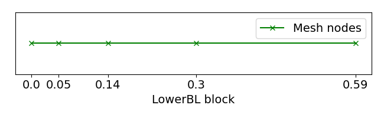
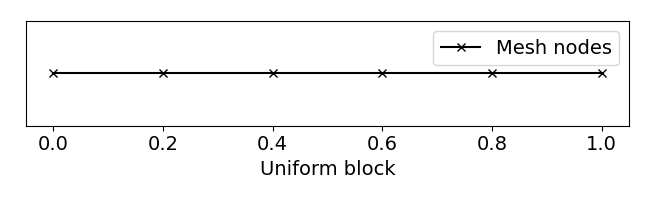
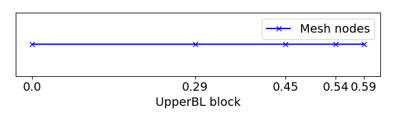
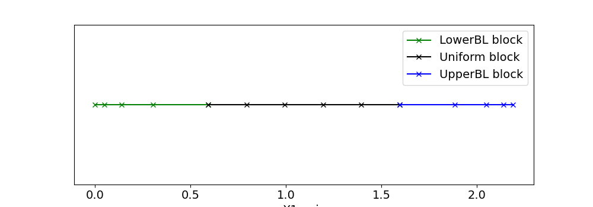

Mesh
=====

In hPIC2, the problem domain is always partitioned into a grid or mesh.
This page describes their construction and properties.

Uniform grid
------------

Uniform grids partition the domain into uniformly sized elements.
In one dimension, a line segment domain is partitioned into
identically sized line segments.
In two dimensions, a rectangular domain is partitioned into
squares.

Multi-block boundary layer
----------------------------

A multi-block boundary layer grid is a type of grid that allows multiple blocks
of grids to be merged together with either uniform cell spacing or geometrically 
graded boundary layer type spacing. This enables large freedom of sampling and 
facilitate to deal the complex boundary layer problems more efficiently.
Multi-block boundary layer grid can be of any dimension, but in hPIC2 we only 
support 1D and 2D.  

1D multi-block boundary layer grid
~~~~~~~~~~~~~~~~~~~~~~~~~~~~~~~~~~

In 1D, the domain is partitioned into a sequence of grid block or segments.
Each block of mesh can be uniform or geometrically graded.
There are three types grid blocks. 
The first type is uniform grid block, which is a uniform grid block.
The second type is lower boundary layer grid block, which is a geometrically
graded grid block with the cell size decreasing from left to right.
The third type is upper boundary layer grid block, which is a geometrically
graded grid block with the cell size increasing from left to right.

The following figure shows an example of a 1D multi-block boundary layer grid that 
includes all three types of grid blocks.

2D multi-block boundary layer grid
~~~~~~~~~~~~~~~~~~~~~~~~~~~~~~~~~~

FD Stencil for 1D First Derivative
^^^^^^^^^^^^^^^^^^^^^^^^^^^^^^^^^^

Unstructured mesh
-----------------

Suppose that the problem domain :math:`\Omega` is polyhedral.
A mesh :math:`\mathcal{T} = \{ T_1, \ldots, T_M \}`
of :math:`\Omega` is admissible if

#. :math:`\bar{\Omega} = \cup_{i=1}^M T_i`;
#. the interiors of elements do not overlap; and,
#. there are no hanging vertices, edges, or faces.

By a hanging vertex, we mean that if the vertex of one element intersects with
another element,
the intersection is the vertex of the other element,
and correspondingly for hanging edges and faces.

In one dimension, the elements are line segments.
In two dimensions, the elements are triangles or quadrilaterals.
In three dimensions, the elements are tetrahedra, hexahedra, wedges, or pyramids.
