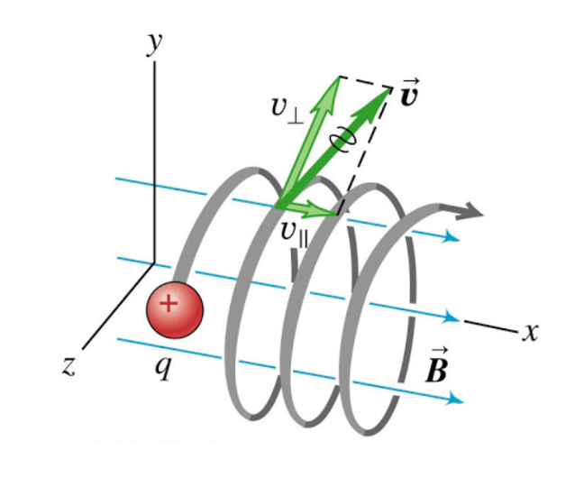

Species
========

This page describes the different models that hPIC2 can use for
a plasma species.

Full-orbit particles
----------------------

The basic particle model of hPIC2 is a classical non-relativistic
full-orbit Lagrangian particle of mass :math:`m` and charge :math:`q`,
with dynamics described by the classical Newton-Lorentz equation,

.. math::

   m \frac{d^2  \mathbf{x} }{dt^2} = q  \mathbf{E}  + q  \mathbf{v}  \times  \mathbf{B}

where the electric field :math:`\mathbf{E}` and the magnetic field
:math:`\mathbf{B}` are either calculated self-consistently by solving the
Maxwell Equations, or provided externally by the user (eg. an imposed
magnetic field).

The Newton-Lorentz equation is integrated by means of the Boris-Bunemann
numerical method, with linearized tangent.

  Full-orbit dynamics of a single charged particle

Boltzmann electrons
----------------------

On ion-transport time scales, the electron behavior can in first
approximation be described simply considering a balance between
electrostatic forces and pressure forces on an isothermal fluid:
:math:`-k_B T_e \nabla n_e + e n_e\nabla \phi \approx 0`, with usual
meaning of symbols as in
:cite:`chen1984introduction`.
Integrating the balance of forces leads to a relation between the
electron particle density and the plasma potential in the form of
equation

.. math::
   :label: botlzmann.equation1

   \begin{aligned}
   n_e(\mathbf{x})=n_0 \exp( e \phi(\mathbf{x})/k_B T_e),\label{botlzmann.equation1}
   \end{aligned}

where :math:`n_0` is the reference electron density corresponding to
:math:`\phi=0`. Boltzmann electrons hold an advantage in terms of
computational cost over the alternative approximations used in PIC
simulations. While alternative methods capture the physical phenomena of
electron motion to a higher degree of accuracy, the added simulation
complexity makes it computationally expensive to run large timescale
simulations.

Time advancement schemes calculate unknown time-dependent variables at
time :math:`t^{k+1} = t^k + \Delta t` from known variables at time
:math:`t^k`. Common time advancement algorithm in PIC codes calculates
the ion density :math:`n_i^{k+1}` using plasma potential :math:`\phi^k`.
Subsequently, the plasma potential :math:`\phi^{k+1}` is solved using
the newly calculated ion density :math:`n_i^{k+1}` and
equation :eq:`botlzmann.equation1`, i.e,;

.. math::
   :label: poision.equation

   \begin{aligned}
   \epsilon_0 \nabla^2\phi^{k+1}(\mathbf{x})&=-\rho^{k+1}(\mathbf{x})\label{poision.equation}\\
   &=en_e^{k+1}(\mathbf{x})-en_i^{k+1}(\mathbf{x})\label{poision.equation1}\\
   &=en_0^{k+1} \exp(\phi^{k+1}(\mathbf{x})/T_e)-en_i^{k+1}(\mathbf{x})\label{poision.equation2}.
   \end{aligned}

Equation :eq:`poision.equation` can be solved
using Newton-Raphson, or other methods, to calculate the plasma
potential for the next iteration. Problems arise when the reference
electron density :math:`n_0` varies with time as is the case in the
presence of a volumetric source/loss, or a boundary flux. A
self-consistent numerical scheme to calculate :math:`n_0^{k+1}` is
required to maintain charge conservation. Breaking charge conservation
leads to numerical oscillations and simulation divergence.

The adoption of Boltzmann electrons always require to enforce
charge conservation through a dedicated scheme.
Details of the charge conservation scheme are described in the
paper `Elias and Curreli <https://doi.org/10.1016/j.jcp.2020.109320>`_,
and are briefly described below.

The charge conservation scheme is derived from the
`Ampere-Maxwell equation <https://doi.org/10.1017/9781108333511>`_ in
differential form,

.. math::
   :label: max.equation1

   \begin{aligned}
   \nabla \times \mathbf{B}&= \mu_0 \mathbf{J} + \epsilon_0 \mu_0 \frac{\partial \mathbf{E}}{\partial t}\label{max.equation1}
   \end{aligned}

As usual, local charge conservation is obtained by taking the divergence
of equation :eq:`max.equation1` and calling the
displacement current as
:math:`\mathbf{J_D}=\epsilon_0 \frac{\partial \mathbf{E}}{\partial t}`

.. math::
   :label: globalcharge.equation1

   \begin{aligned}
   \nabla \cdot (\nabla \times \mathbf{B})&= \mu_0 \nabla \cdot \mathbf{J}  +\mu_0 \nabla \cdot \left( \epsilon_0  \frac{\partial \mathbf{E}}{\partial t} \right) \label{max.equation2}\\
   0 &=\nabla \cdot \mathbf{J} + \nabla \cdot \mathbf{J}_D, \label{globalcharge.equation1}
   \end{aligned}

where the conduction current
:math:`\mathbf{J}=\mathbf{J}_i + \mathbf{J}_e` is the sum of the
contributions from the ion current :math:`\mathbf{J}_i` and the electron
current :math:`\mathbf{J}_e`.
Equation :eq:`globalcharge.equation1` can
equivalently be expressed as

.. math::

   \begin{aligned}
    \nabla \cdot (\mathbf{J}_e + \mathbf{J}_i  + \mathbf{J}_D)&=0 \label{globalcharge.equation2}
   \end{aligned}

or using its integral form,

.. math::
   :label: displacemen.equation1

   \begin{aligned}
   \int_V \nabla \cdot (\mathbf{J}_e + \mathbf{J}_i  + \mathbf{J}_D) dV&= 0  \label{displacemen.equation1}
   \end{aligned}

In the presence of volumetric source :math:`G` and loss :math:`L` terms,
equation :eq:`displacemen.equation1` becomes

.. math::
   :label: displacemen.equation2

   \begin{aligned}
   \int_V \nabla \cdot (\mathbf{J}_e + \mathbf{J}_i  + \mathbf{J}_D) dV&= G-L \label{displacemen.equation2}
   \end{aligned}

The Boltzmann electron model described in
equation :eq:`botlzmann.equation1` implicitly
assumes the electron distribution is at a Maxwellian thermal
equilibrium. For a Maxwellian thermal distribution, with a mean thermal
electron velocity :math:`\mathbf{u_e}=\sqrt{\frac{8 K_b T_e}{\pi m_e}}`,
the current density at the location :math:`\mathbf{x}` can,
as in :cite:`chen1984introduction`,
be expressed as

.. math::
   :label: boundaryflux

   \begin{aligned}
   \mathbf{J}_e(\mathbf{x})=-e \boldsymbol{\Gamma}_e(\mathbf{x})=-e n_0 \mathbf{u}_e \exp(e\Phi(\mathbf{x})/T_e) \label{boundaryflux}
   \end{aligned}

By substituting Equation :eq:`boundaryflux` into
Equation :eq:`displacemen.equation2` and
solving for :math:`n_0`, immediately yields an expression for the
reference Boltzmann electron density :math:`n_0`

.. math::
   :label: density_update

   \begin{aligned}
   n_0= \frac{\int_V \nabla \cdot (\mathbf{J}_i  + \mathbf{J}_D) dV - G + L }{\int_V \nabla \cdot e \mathbf{u}_e \exp(e\Phi(\mathbf{x})/T_e) dV}
   \label{density_update}
   \end{aligned}

Equation :eq:`density_update` can be directly used to
enforce global charge conservation in explicit PIC schemes with
Boltzmann electrons. An example algorithm is discussed hereafter.

A simple explicit algorithm implementing
Equation :eq:`density_update` for updating the
Boltzmann density :math:`n_0` from time step :math:`t^{k}` to time step
:math:`t^{k+1}` is as follows.

#. Calculate ion density :math:`n_i^{k+1}` using the plasma potential
   :math:`\phi^k` at the previous time step, using the classical
   explicit PIC scheme;

#. Calculate reference Boltzmann electron density at :math:`n_0^{k+1}`
   at time step :math:`t^{k+1}` using
   equation :eq:`density_update` and boundary
   conditions for :math:`\phi^{k+1}`;

   .. math::

      \begin{aligned}
          n_0^{k+1}= \frac{\int_V \nabla \cdot (\mathbf{J}_i^{k+1} + \mathbf{J}_D^{k}) dV - G^{k+1} + L^{k+1} }{\int_V \nabla \cdot e \mathbf{u_e} \exp(e\phi^{k+1}/T_e) dV}
          \label{density_update1}

      \end{aligned}

#. Solve the plasma potential :math:`\phi^{k+1}` using ion density
   :math:`n_i^{k+1}`, boundary conditions for :math:`\phi^{k+1}`, the
   Poisson equation and reference Boltzmann electron reference density
   :math:`n_0^{k+1}`.

The algorithm can be equally applied to plasma domains of arbitrary
dimensionality in 1D, 2D or 3D without any loss of accuracy. However,
the conventional Courant–Friedrichs–Lewy (CFL) condition on the time
step remains necessary to ensure accuracy on the particle pusher, and to
resolve ion-timescale phenomena. In the next section we apply this
algorithm to two cases, a steady-state plasma sheath and a
radio-frequency plasma sheath.

Euler fluid
------------

Many important physical quantities can be computed as moments
of a distribution in velocity space.
The number density :math:`n = n(\vec{x}, t)` of a species
described by the distribution :math:`f` can be computed as

.. math::

    n = \int_{\mathbb{R}^3} f \, \mathrm{d} \vec{v};

the momentum density :math:`n m \vec{u} = n m \vec{u}(\vec{x}, t)` is

.. math::

    n m \vec{u} = \int_{\mathbb{R}^3} m \vec{v} f \, \mathrm{d} \vec{v};

the stress tensor :math:`P_{ij} = P_{ij} (\vec{x}, t)` is

.. math::

    P_{ij} = \int_{\mathbb{R}^3} m v_i v_j f \, \mathrm{d} \vec{v};

and the energy flux density :math:`\vec{Q} = \vec{Q}(\vec{x}, t)` is

.. math::

    \vec{Q} = \int_{\mathbb{R}^3} \frac{1}{2} m v^2 \vec{v} f \, \mathrm{d} \vec{v}.

It is also useful to name some moments in the reference frame of the
moving species.
With :math:`\vec{w} = \vec{v} - \vec{u}`, let

.. math::

    p_{ij} = \int_{\mathbb{R}^3} m w_i w_j f \, \mathrm{d} \vec{v}

be the pressure tensor,
and let

.. math::

    \vec{q} = \int_{\mathbb{R}^3} \frac{1}{2} m w^2 \vec{w} f \, \mathrm{d} \vec{v}

be the heat flux density.
For convenience, let :math:`p = p_{ii}/3` be the scalar pressure
and decompose the pressure tensor as

.. math::

    p_{ij} = p \delta_{ij} + \pi_{ij},

where :math:`\pi_{ij}` is the generalized viscosity tensor.
Finally,

.. math::

    n m E = \int_{\mathbb{R}^3} H f \, \mathrm{d} \vec{v}

with the single-particle Hamiltonian
:math:`H = \frac{1}{2} m v^2`
is the total energy density.

The Euler equations can be derived from the
:ref:`overview:Boltzmann kinetic equation`
by computing moments as

.. math::

    \int_{\mathbb{R}^3} \psi \left[ \frac{\partial f}{\partial t} +
    \vec{v} \cdot \frac{\partial f}{\partial \vec{x}} +
    \frac{q}{m} \left( \vec{E} + \vec{v} \times \vec{B} \right) \cdot \frac{\partial f}{\partial \vec{v}}
    \right] \, \mathrm{d} \vec{v} = \int_{\mathbb{R}^3} \psi \mathcal{C} [f] \, \mathrm{d} \vec{v},

where :math:`\psi = \psi(\vec{v})` is a polynomial.
In particular, take :math:`\psi = m`, :math:`m \vec{v}`,
and :math:`\frac{1}{2} m v^2`.
This ultimately yields

.. math::

    \frac{\partial}{\partial t} (nm) + \nabla \cdot (n m \vec{u}) = \int_{\mathbb{R}^3} m \mathcal{C}[f] \, \mathrm{d} \vec{v},

    \frac{\partial}{\partial t} (nmu_i) + \frac{\partial}{\partial x_j} P_{ij} - q n (\vec{E} + \vec{u} \times \vec{B})_i = \int_{\mathbb{R}^3} m \vec{v} \mathcal{C}[f] \, \mathrm{d} \vec{v},

    \frac{\partial}{\partial t} (nmE) + \nabla \cdot \left(nmE \vec{u} + \vec{q} + p \vec{u} + \pi_{ij} u_j \right) - q n \vec{u} \cdot \vec{E} = \int_{\mathbb{R}^3} H \mathcal{C}[f] \, \mathrm{d} \vec{v}.

These equations are closed by assuming that the heat flux density and
generalized viscosity tensor are zero
and relating the scalar pressure to the remaining fluid state variables
through an equation of state (EOS), resulting in

.. math::

    \frac{\partial}{\partial t} (nm) + \nabla \cdot (n m \vec{u}) = \int_{\mathbb{R}^3} m \mathcal{C}[f] \, \mathrm{d} \vec{v},

    \frac{\partial}{\partial t} (nmu_i) + \frac{\partial}{\partial x_j} \left( n m u_i u_j + p \delta_{ij} \right) = q n (\vec{E} + \vec{u} \times \vec{B})_i + \int_{\mathbb{R}^3} m \vec{v} \mathcal{C}[f] \, \mathrm{d} \vec{v},

    \frac{\partial}{\partial t} (nmE) + \nabla \cdot \left(nmE \vec{u} + p \vec{u} \right) = q n \vec{u} \cdot \vec{E} + \int_{\mathbb{R}^3} H \mathcal{C}[f] \, \mathrm{d} \vec{v}.

A common analytic EOS is the ideal gas law

.. math::

    p = n k T,

where :math:`k` is the Boltzmann constant
and :math:`T` is the temperature,
combined with the equipartition theorem for calorically perfect gases

.. math::

    n m E = \frac{1}{2} n m u^2 + \frac{1}{\gamma - 1} n k T,

which yields

.. math::

    p = (\gamma - 1) \left( n m E - \frac{1}{2} n m u^2 \right).

Uniform background
-------------------

This model assumes that the species follows a Maxwellian
distribution everywhere in space,
so that the distribution is

.. math::

    f = n \sqrt{\frac{m}{2 \pi k T}} \exp \left( - \frac{m v^2}{2 k T} \right)

for a given number density :math:`n` and temperature :math:`T`.
The charge density is therefore simply :math:`\rho = q n`.
