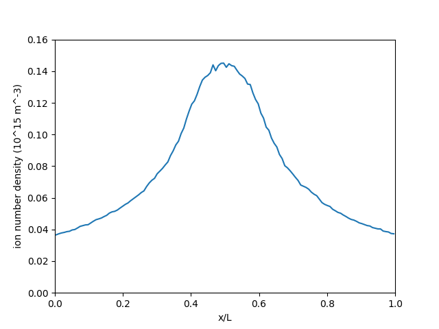

Turner benchmarks
=================

Problem Description
--------------------

Monte Carlo collisions (MCC) are used to model kinetic particles colliding with
a continuum background species.
Collisional problems are difficult to predict analyically,
so benchmark problems, where output from one code is compared to output
from another, trusted code, are acceptable.
One suite of benchmark problems comes from Turner :cite:`turner2013simulation`.
These problems model a capacitive, RF discharge of a helium plasma
under various low-pressure conditions.

Theory
---------

A full description of MCC is provided on the
:ref:`interactions <interactions:Monte Carlo collisions>`
page.
To summarize, for each colliding "source" particle,
a "target" particle is randomly drawn from the continuum species.
For each possible collision, the associated cross section is computed and
used to compute a collision probability.
A random number is drawn to decide between each possible collision,
and if one is selected, that collision is performed.

Simulation Setup
-------------------

* One-dimensional domain

* Uniform mesh

* Absorbing boundaries for charged particles

* Neutral helium background with temperature :math:`T = 300` K

* Ion temperature: :math:`T_i = 300` K

* Electron temperature: :math:`T_e = 30000` K

Input Files
-------------

There are four test cases.
:download:`This <../../../examples/turner_test_generator.py>` Python script
can be used to generate the input decks for each one.

The cross section data is copyrighted and therefore not provided.
To get this data, write it in a format readable by hPIC2,
and generate the input decks,

#. Download the supplementary material from Turner's paper:
   https://doi.org/10.1063/1.4775084
#. Copy the cross section data into space-separated .dat files for each
   collision type, with the units converted to SI, e.g. eV converted to joules.
   The filenames should be
   :code:`he_ion_elastic.dat` for the ion-neutral isotropic elastic collisions,
   :code:`he_ion_back.dat` for the ion-neutral backscattering collisions,
   :code:`he_electron_elastic.dat` for the electron-neutral elastic collisions,
   :code:`he_electron_excitation_1.dat` for the first set of excitation collisions,
   :code:`he_electron_excitation_2.dat` for the second set of excitation collisions, and
   :code:`he_electron_ionization.dat` for the electron-neutral ionization collisions.
#. Run

   .. code-block:: bash

      python3 turner_test_generator.py

This writes the four input decks, named :code:`test_n.toml`
where n runs 1 through 4.

Running
----------

To run a simulation, using the following command:

.. code-block:: bash

    ./hpic2 --i test_n.toml

Plotting the results
---------------------

The simulation results are stored in ``test_n_out``.
The key output is the ion density.
The test generator Python script can also be used to
create plots of the ion number density, averaged over the last few timesteps,
in exactly the same manner as in the Turner paper.
Simply run

.. code-block:: bash

    python3 turner_test_generator.py test_n

to create the plot for the n-th test case.
An example of the plot for the first test case is shown below.

